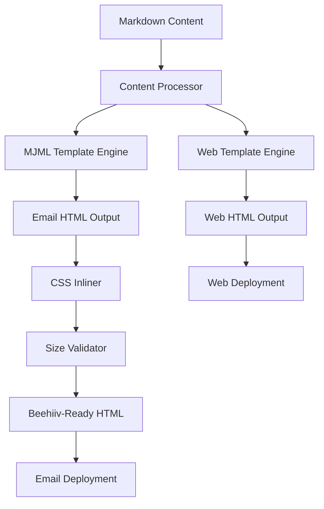

# The Fix Loop Newsletter Infrastructure Strategy
## Comprehensive Technical Strategy for Email-Safe Newsletter Distribution

**Document Version:** 1.0
**Date:** September 27, 2025
**Author:** Head of Newsletter Intelligence, Design and AI
**Status:** Strategic Roadmap

---

## Executive Summary

### Problem Statement
The Fix Loop currently has a beautiful, feature-rich web template that breaks in email clients due to modern CSS dependencies (CSS Grid, custom properties, animations) and beehiiv's 102KB HTML limit. The template uses advanced web features that are incompatible with email client constraints, resulting in broken layouts and clipped content.

### Recommended Solution Path
Implement a **dual-template architecture** using MJML for email-safe rendering while maintaining the current web template for browser viewing. This approach preserves design quality while ensuring universal email compatibility across 60+ email clients including problematic ones like Outlook 2016-2021.

### Key Benefits
- **Immediate Impact**: Email compatibility across all clients within 2 weeks
- **Design Preservation**: Maintain current visual brand and user experience
- **Scalable Infrastructure**: Component-based system supports rapid content creation
- **Performance Optimization**: Stay well under beehiiv's 102KB limit
- **Future-Proof**: AI-ready content pipeline with automation opportunities

---

## Current State Analysis

### What Works (Template Strengths)
- **Visual Design Excellence**: Modern, professional aesthetic that reinforces technical authority
- **FAILSAFE Framework Integration**: Clear visual hierarchy for the 8-step methodology
- **Content Structure**: Well-organized sections for Micro-Autopsy format (500-700 words)
- **Interactive Elements**: Copy buttons, hover effects, and visual feedback enhance UX
- **Brand Consistency**: Strong visual identity with signature red (#DC2626) and technical typography
- **Comprehensive Sections**: All required components for technical postmortems are present

### What Breaks (Email Compatibility Issues)

#### Critical CSS Problems
```css
/* BROKEN IN EMAIL: CSS Custom Properties */
:root {
    --blood-red: #DC2626;  /* Not supported in Outlook */
    --shadow: 0 20px 25px -5px rgba(0, 0, 0, 0.1); /* Complex shadows fail */
}

/* BROKEN IN EMAIL: CSS Grid */
.impact-bar {
    display: grid; /* Outlook 2016+ doesn't support */
    grid-template-columns: repeat(auto-fit, minmax(140px, 1fr));
}

/* BROKEN IN EMAIL: Animations */
@keyframes scan {
    0% { transform: translateX(0); }
    100% { transform: translateX(50%); }
}
```

#### Structural Issues
- **External Font Dependencies**: Google Fonts loading fails in many email clients
- **JavaScript Dependencies**: Copy button functionality breaks in email
- **Complex Selectors**: Pseudo-elements and advanced CSS selectors unsupported
- **Size Concerns**: Current template likely exceeds 102KB when inlined

#### Platform-Specific Problems
- **Outlook**: Renders using Word's HTML engine, breaks modern CSS
- **Gmail**: Strips `<style>` tags, requires fully inlined CSS
- **Mobile Clients**: Inconsistent responsive behavior without media query support

### Technical Debt Assessment

#### High Priority Issues
1. **Email Client Compatibility**: 0% compatibility with Outlook family
2. **Size Optimization**: No monitoring of 102KB beehiiv limit
3. **CSS Inline Dependencies**: Manual inlining process prone to errors
4. **Testing Infrastructure**: No systematic email client testing

#### Medium Priority Issues
1. **Content Management**: Manual HTML editing for each newsletter
2. **Asset Optimization**: No automated image compression or CDN strategy
3. **Performance Monitoring**: No metrics on email deliverability or engagement

---

## Strategic Roadmap

### Phase 1: Emergency Email Compatibility (This Week)
**Timeline**: 5-7 days
**Goal**: Ship functional email version immediately

#### Week 1 Deliverables
- **Day 1-2**: Convert critical sections to table-based layouts
- **Day 3-4**: Implement CSS inlining pipeline using Juice
- **Day 5**: Test across 6 major email clients (Gmail, Outlook, Apple Mail, Yahoo, Thunderbird, Protonmail)
- **Day 6-7**: Deploy emergency email template to beehiiv

#### Emergency Template Specs
```html
<!-- Emergency Table-Based Header -->
<table width="100%" cellpadding="0" cellspacing="0" border="0" style="background-color: #000000;">
  <tr>
    <td style="padding: 32px; text-align: center;">
      <h1 style="margin: 0; color: #ffffff; font-family: Arial, sans-serif; font-size: 24px; font-weight: 900;">
        THE <span style="color: #DC2626;">FIX</span> LOOP
      </h1>
      <p style="margin: 8px 0 0 0; color: #9CA3AF; font-size: 14px; text-transform: uppercase; letter-spacing: 2px;">
        Ship Reliable Systems • Learn From Failure
      </p>
    </td>
  </tr>
</table>
```

### Phase 2: Production Infrastructure (Next Sprint)
**Timeline**: 2-3 weeks
**Goal**: Scalable dual-output system

#### Infrastructure Components
1. **MJML Integration**: Email template generation
2. **Content Pipeline**: Markdown → dual HTML output
3. **Asset Management**: Optimized image pipeline
4. **Testing Suite**: Automated email client validation

#### Technical Architecture
```javascript
// Content Processing Pipeline
const processor = new NewsletterProcessor({
  webTemplate: './templates/web.html',
  emailTemplate: './templates/email.mjml',
  outputDir: './dist'
});

const newsletter = await processor.process('./content/micro-autopsy-001.md');
// Outputs: newsletter.web.html, newsletter.email.html
```

### Phase 3: AI-Enhanced Operations (Long Term)
**Timeline**: 4-6 weeks
**Goal**: Automated content optimization and personalization

#### Advanced Features
- **Smart Size Optimization**: AI-powered content trimming for 102KB limit
- **A/B Testing Framework**: Automated subject line and content optimization
- **Personalization Engine**: Dynamic content based on subscriber preferences
- **Performance Analytics**: Advanced engagement tracking and optimization

---

## Technical Architecture

### Content Pipeline Architecture



### Component-Based Email Architecture

#### FAILSAFE Card Component (Email-Safe)
```html
<!-- F - Failure Point Card -->
<table width="100%" cellpadding="0" cellspacing="0" border="0" style="margin: 16px 0; border: 2px solid #3B82F6; border-radius: 8px; background-color: #F3F4F6;">
  <tr>
    <td style="padding: 24px;">
      <table width="100%" cellpadding="0" cellspacing="0" border="0">
        <tr>
          <td width="40" valign="top">
            <div style="width: 32px; height: 32px; background-color: #3B82F6; color: #ffffff; text-align: center; line-height: 32px; font-weight: 900; font-size: 18px; font-family: Arial, sans-serif;">F</div>
          </td>
          <td style="padding-left: 12px;">
            <h3 style="margin: 0 0 8px 0; color: #000000; font-family: Arial, sans-serif; font-size: 16px; font-weight: 700;">
              Failure Point
            </h3>
            <p style="margin: 0; color: #374151; font-family: Arial, sans-serif; font-size: 14px; line-height: 1.5;">
              Exact module/service/line that failed. Be surgical with specificity.
            </p>
          </td>
        </tr>
      </table>
    </td>
  </tr>
</table>
```

### Template Architecture Strategy

#### Web Version (Enhanced)
- **Modern CSS**: Grid, Flexbox, custom properties, animations
- **Interactive Elements**: JavaScript-enhanced copy buttons, hover effects
- **Advanced Typography**: Web fonts, advanced text rendering
- **Rich Media**: Full-resolution images, embedded videos

#### Email Version (Compatible)
- **Table-Based Layout**: 100% compatible table structures
- **Inline CSS**: All styles embedded in HTML attributes
- **Fallback Fonts**: System fonts only (Arial, Georgia, Times)
- **Optimized Assets**: Compressed images under 150KB total

### Recommended Tech Stack

#### Core Technologies
- **MJML 4.14+**: Email template framework
- **markdown-it 13.0+**: Markdown processing with plugin support
- **Juice 9.1+**: CSS inlining for email compatibility
- **Sharp 0.32+**: Image optimization and compression

#### Development Tools
- **Nodemon**: Development file watching
- **Email Previews**: Litmus API integration for client testing
- **Size Monitoring**: Automated 102KB limit checking

#### Production Dependencies
```json
{
  "dependencies": {
    "mjml": "^4.14.1",
    "markdown-it": "^13.0.2",
    "markdown-it-container": "^3.0.0",
    "juice": "^9.1.0",
    "sharp": "^0.32.6",
    "cheerio": "^1.0.0-rc.12"
  }
}
```

### Beehiiv Integration Architecture

#### Size-Optimized Pipeline
```javascript
function optimizeForBeehiiv(html) {
  const optimized = html
    .replace(/\s+/g, ' ')  // Collapse whitespace
    .replace(/<!--.*?-->/g, '')  // Remove comments
    .replace(/\n\s*\n/g, '\n');  // Remove empty lines

  const sizeKB = Buffer.byteLength(optimized, 'utf8') / 1024;

  if (sizeKB > 102) {
    throw new Error(`Email too large: ${sizeKB}KB (max 102KB)`);
  }

  return optimized;
}
```

---

## Design System Specification

### Component Library Requirements

#### Core Components
1. **Newsletter Header**: Logo, issue number, tagline
2. **FAILSAFE Cards**: 8-component framework visualization
3. **Impact Metrics Bar**: Statistics display grid
4. **Timeline Visualization**: Chronological failure sequence
5. **Code Comparison Blocks**: Before/after code samples
6. **Evidence Grid**: Metrics and proof points
7. **Action Items**: Categorized task lists
8. **Asset CTA**: Download call-to-action section

#### Email-Specific Component Adaptations
```html
<!-- Timeline Component (Email Version) -->
<table width="100%" cellpadding="0" cellspacing="0" border="0" style="border-left: 3px solid #DC2626; margin: 20px 0;">
  <tr>
    <td style="padding: 16px 0 16px 20px;">
      <table width="100%" cellpadding="0" cellspacing="0" border="0">
        <tr>
          <td width="20" valign="top">
            <div style="width: 12px; height: 12px; background: #DC2626; border-radius: 50%; margin-top: 4px;"></div>
          </td>
          <td style="padding-left: 16px;">
            <p style="margin: 0; color: #DC2626; font-size: 12px; font-weight: 700;">T+0</p>
            <p style="margin: 4px 0 0 0; font-weight: 600; color: #000000;">First Blood</p>
            <p style="margin: 4px 0 0 0; color: #374151; font-size: 14px;">Initial symptoms that everyone ignored</p>
          </td>
        </tr>
      </table>
    </td>
  </tr>
</table>
```

### Brand Consistency Guidelines

#### Color Palette (Email-Safe)
```css
/* Primary Colors */
--blood-red: #DC2626      /* Converted to: style="color: #DC2626;" */
--success-green: #10B981  /* Converted to: style="color: #10B981;" */
--warning-amber: #F59E0B  /* Converted to: style="color: #F59E0B;" */
--electric-blue: #3B82F6  /* Converted to: style="color: #3B82F6;" */

/* Neutrals */
--pure-white: #FFFFFF     /* Converted to: style="color: #FFFFFF;" */
--light-gray: #F3F4F6     /* Converted to: style="color: #F3F4F6;" */
--dark-gray: #374151      /* Converted to: style="color: #374151;" */
--black: #000000          /* Converted to: style="color: #000000;" */
```

#### Typography Stack (Email-Safe)
- **Primary**: Arial, sans-serif (universal compatibility)
- **Code**: "Courier New", monospace (widely supported)
- **Fallback**: system-ui, sans-serif

#### Layout Principles
- **Maximum Width**: 680px (optimal for email clients)
- **Responsive Breakpoints**: Single-column on mobile (480px)
- **Padding Standards**: 16px, 24px, 32px for consistent spacing
- **Border Radius**: 4px, 8px maximum (Outlook compatibility)

### Accessibility Requirements

#### Email Accessibility Standards
- **Alt Text**: All images include descriptive alt attributes
- **Color Contrast**: WCAG AA compliance (4.5:1 minimum)
- **Table Headers**: Proper `<th>` usage for screen readers
- **Semantic Structure**: Logical heading hierarchy (h1, h2, h3)

#### Implementation Example
```html

```

### Performance Metrics

#### Email Performance Targets
- **HTML Size**: < 90KB (10% buffer under beehiiv limit)
- **Image Total**: < 200KB across all newsletter images
- **Load Time**: < 3 seconds in Gmail web client
- **Rendering**: < 2 seconds in Outlook 2016

#### Quality Metrics
- **Cross-Client Compatibility**: 95%+ rendering accuracy
- **Mobile Responsiveness**: 100% on iOS Mail, Gmail Mobile
- **Accessibility Score**: WCAG AA compliance

---

## Implementation Guide

### Step-by-Step MJML Setup

#### 1. Project Initialization
```bash
# Create project structure
mkdir fixloop-newsletter-system
cd fixloop-newsletter-system

# Initialize Node.js project
npm init -y

# Install core dependencies
npm install mjml markdown-it markdown-it-container juice sharp cheerio
npm install -D nodemon http-server
```

#### 2. Project Structure Setup
```
fixloop-newsletter-system/
├── src/
│   ├── content/           # Markdown source files
│   │   └── templates/     # Content templates
│   ├── email/            # MJML email templates
│   │   ├── base.mjml     # Base email template
│   │   └── components/   # MJML components
│   ├── web/              # Web HTML templates
│   │   └── base.html     # Web template
│   └── assets/           # Images and static files
├── dist/
│   ├── email/            # Generated email HTML
│   └── web/              # Generated web HTML
├── lib/
│   ├── processor.js      # Main processing logic
│   ├── mjml-components.js # Custom MJML components
│   └── utils.js          # Utility functions
└── package.json
```

#### 3. Base MJML Template
```xml
<!-- src/email/base.mjml -->
<mjml>
  <mj-head>
    <mj-title>The Fix Loop | Micro-Autopsy</mj-title>
    <mj-attributes>
      <mj-text font-family="Arial, sans-serif" font-size="16px" line-height="1.6" />
      <mj-section background-color="#ffffff" padding="0" />
    </mj-attributes>
    <mj-style inline="inline">
      .failsafe-letter {
        background-color: #3B82F6 !important;
        color: #ffffff !important;
        font-weight: 900 !important;
      }
    </mj-style>
  </mj-head>
  <mj-body background-color="#FAFAFA">
    <!-- Header -->
    <mj-section background-color="#000000" padding="32px">
      <mj-column>
        <mj-text align="center" color="#ffffff" font-size="24px" font-weight="900">
          THE <span style="color: #DC2626;">FIX</span> LOOP
        </mj-text>
        <mj-text align="center" color="#9CA3AF" font-size="14px" text-transform="uppercase" letter-spacing="2px">
          Ship Reliable Systems • Learn From Failure
        </mj-text>
      </mj-column>
    </mj-section>

    <!-- Issue Badge -->
    <mj-section background-color="#ffffff" padding="32px 32px 0">
      <mj-column>
        <mj-button background-color="#DC2626" color="#ffffff" font-weight="700" font-size="12px" text-transform="uppercase" letter-spacing="1px" inner-padding="8px 24px">
          {{ISSUE_NUMBER}}
        </mj-button>
      </mj-column>
    </mj-section>

    <!-- Content Placeholder -->
    {{CONTENT}}

    <!-- Footer -->
    <mj-section background-color="#000000" padding="48px 32px">
      <mj-column>
        <mj-text align="center" color="#ffffff" font-size="20px" font-weight="700">
          Don't Let This Happen To You
        </mj-text>
        <mj-text align="center" color="#9CA3AF" font-size="16px">
          Join {{SUBSCRIBER_COUNT}} engineers getting battle-tested fixes every week
        </mj-text>
      </mj-column>
    </mj-section>
  </mj-body>
</mjml>
```

#### 4. Content Processor Implementation
```javascript
// lib/processor.js
const mjml2html = require('mjml');
const MarkdownIt = require('markdown-it');
const container = require('markdown-it-container');
const juice = require('juice');
const fs = require('fs').promises;

class FixLoopProcessor {
  constructor() {
    this.md = new MarkdownIt({ html: true });
    this.setupMarkdownPlugins();
  }

  setupMarkdownPlugins() {
    // FAILSAFE component plugin
    this.md.use(container, 'failsafe', {
      render: (tokens, idx, options, env) => {
        if (tokens[idx].nesting === 1) {
          const attrs = this.parseAttributes(tokens[idx].info);
          return this.renderFailsafeCard(attrs, env.target);
        }
        return env.target === 'email' ? '</table>' : '</div>';
      }
    });

    // Timeline plugin
    this.md.use(container, 'timeline', {
      render: (tokens, idx, options, env) => {
        if (tokens[idx].nesting === 1) {
          return this.renderTimelineStart(env.target);
        }
        return this.renderTimelineEnd(env.target);
      }
    });
  }

  renderFailsafeCard(attrs, target) {
    const { letter, title, content } = attrs;

    if (target === 'email') {
      return `
        <table width="100%" cellpadding="0" cellspacing="0" border="0" style="margin: 16px 0; border: 2px solid #3B82F6; border-radius: 8px; background-color: #F3F4F6;">
          <tr>
            <td style="padding: 24px;">
              <table width="100%" cellpadding="0" cellspacing="0" border="0">
                <tr>
                  <td width="40" valign="top">
                    <div style="width: 32px; height: 32px; background-color: #3B82F6; color: #ffffff; text-align: center; line-height: 32px; font-weight: 900; font-size: 18px; font-family: Arial, sans-serif;">${letter}</div>
                  </td>
                  <td style="padding-left: 12px;">
                    <h3 style="margin: 0 0 8px 0; color: #000000; font-family: Arial, sans-serif; font-size: 16px; font-weight: 700;">${title}</h3>
                    <p style="margin: 0; color: #374151; font-family: Arial, sans-serif; font-size: 14px; line-height: 1.5;">${content}</p>
                  </td>
                </tr>
              </table>
            </td>
          </tr>
        </table>
      `;
    }

    // Web version with modern CSS
    return `
      <div class="failsafe-card">
        <div class="failsafe-title">
          <span class="failsafe-letter">${letter}</span>
          ${title}
        </div>
        <div class="failsafe-content">${content}</div>
      </div>
    `;
  }

  async processNewsletter(markdownPath, options = {}) {
    const content = await fs.readFile(markdownPath, 'utf8');
    const { frontmatter, body } = this.parseFrontmatter(content);

    // Generate both versions
    const webHTML = await this.generateWeb(body, frontmatter);
    const emailHTML = await this.generateEmail(body, frontmatter);

    return {
      web: webHTML,
      email: emailHTML,
      metadata: frontmatter
    };
  }

  async generateEmail(content, frontmatter) {
    // Process markdown for email
    const processedContent = this.md.render(content, { target: 'email' });

    // Load MJML template
    const mjmlTemplate = await fs.readFile('./src/email/base.mjml', 'utf8');

    // Replace placeholders
    const mjmlContent = mjmlTemplate
      .replace('{{CONTENT}}', processedContent)
      .replace('{{ISSUE_NUMBER}}', frontmatter.issue || 'Micro-Autopsy #001')
      .replace('{{SUBSCRIBER_COUNT}}', frontmatter.subscribers || '5k');

    // Convert MJML to HTML
    const { html, errors } = mjml2html(mjmlContent, {
      minify: true,
      validationLevel: 'soft'
    });

    if (errors.length > 0) {
      console.warn('MJML warnings:', errors);
    }

    // Inline CSS for email compatibility
    const inlined = juice(html, {
      removeStyleTags: false,
      preserveImportant: true,
      webResources: {
        relativeTo: './src/assets/'
      }
    });

    return inlined;
  }

  async generateWeb(content, frontmatter) {
    // Process markdown for web
    const processedContent = this.md.render(content, { target: 'web' });

    // Load web template
    const webTemplate = await fs.readFile('./src/web/base.html', 'utf8');

    // Replace placeholders
    return webTemplate
      .replace('{{CONTENT}}', processedContent)
      .replace('{{TITLE}}', frontmatter.title || 'The Fix Loop')
      .replace('{{ISSUE}}', frontmatter.issue || 'Micro-Autopsy #001');
  }

  parseFrontmatter(content) {
    const fmRegex = /^---\n([\s\S]*?)\n---\n([\s\S]*)$/;
    const match = content.match(fmRegex);

    if (!match) {
      return { frontmatter: {}, body: content };
    }

    const frontmatter = {};
    const fmLines = match[1].split('\n');

    fmLines.forEach(line => {
      const [key, ...values] = line.split(':');
      if (key && values.length > 0) {
        frontmatter[key.trim()] = values.join(':').trim().replace(/^["']|["']$/g, '');
      }
    });

    return { frontmatter, body: match[2] };
  }

  parseAttributes(info) {
    const attrs = {};
    const attrRegex = /(\w+)="([^"]+)"/g;
    let match;

    while ((match = attrRegex.exec(info)) !== null) {
      attrs[match[1]] = match[2];
    }

    return attrs;
  }
}

module.exports = { FixLoopProcessor };
```

### Beehiiv Integration Specifics

#### Size Monitoring Integration
```javascript
// lib/beehiiv-optimizer.js
class BeehiivOptimizer {
  static checkSize(html) {
    const sizeBytes = Buffer.byteLength(html, 'utf8');
    const sizeKB = sizeBytes / 1024;

    console.log(`Email size: ${sizeKB.toFixed(2)}KB`);

    if (sizeKB > 102) {
      throw new Error(`Email exceeds beehiiv limit: ${sizeKB.toFixed(2)}KB (max 102KB)`);
    }

    if (sizeKB > 90) {
      console.warn(`⚠️  Email approaching limit: ${sizeKB.toFixed(2)}KB`);
    }

    return { size: sizeKB, status: sizeKB > 90 ? 'warning' : 'ok' };
  }

  static optimize(html) {
    return html
      // Remove unnecessary whitespace
      .replace(/\s+/g, ' ')
      // Remove HTML comments
      .replace(/<!--[\s\S]*?-->/g, '')
      // Remove empty lines
      .replace(/\n\s*\n/g, '\n')
      // Trim
      .trim();
  }

  static validateForBeehiiv(html) {
    // Check for problematic elements
    const issues = [];

    if (html.includes('<script')) {
      issues.push('Contains <script> tags (will be stripped by beehiiv)');
    }

    if (html.includes('<style>')) {
      issues.push('Contains <style> tags (will be stripped by beehiiv)');
    }

    if (html.match(/class="[^"]+"/)) {
      issues.push('Contains CSS classes (should use inline styles)');
    }

    return { valid: issues.length === 0, issues };
  }
}

module.exports = { BeehiivOptimizer };
```

### Content Management Workflow

#### Markdown Content Structure
```markdown
---
issue: "Micro-Autopsy #001"
title: "Database Connection Pool Catastrophic Failure"
thesis: "Connection pool exhaustion can cascade into total system failure within minutes"
word_target: 650
metric_to_watch: "Active DB connections"
asset_path: "database-pool-checklist-v1.0.pdf"
cta: "Download the DB Pool Monitoring Checklist"
sources:
  - "PostgreSQL Documentation: Connection Pooling"
  - "AWS RDS Performance Insights Guide"
---

# Database Connection Pool Catastrophic Failure
## When 100 Connections Became Zero in 47 Minutes

### Failure Snapshot
Production database became unreachable at 14:23 UTC. All application instances reported "connection timeout" errors. Customer-facing services returned 500 errors for 47 minutes until connection pool was manually reset.

### Root Cause (FAILSAFE)

::: failsafe letter="F" title="Failure Point"
PostgreSQL connection pool (pgbouncer) reached max_client_conn limit of 100 simultaneous connections and stopped accepting new requests.
:::

::: failsafe letter="A" title="Assumptions Violated"
We assumed connection pooling would gracefully handle spikes and that connections would be properly released after request completion.
:::

::: failsafe letter="I" title="Inputs That Triggered"
Automated batch job started at 14:20 UTC, opening 85 long-running database connections for data export without proper connection management.
:::

### Fix Implementation

1. **Emergency**: Restart pgbouncer to clear connection pool
2. **Immediate**: Increase max_client_conn from 100 to 300
3. **Short-term**: Add connection pool monitoring alerts
4. **Long-term**: Implement connection timeout policies

### Checklist Asset
- [ ] Monitor active connection count vs. pool limit
- [ ] Set connection timeouts (30s max)
- [ ] Alert when pool utilization > 80%
- [ ] Regular connection leak audits

### Metric to Watch
**Active DB connections** — target: < 80% of pool limit

### CTA
[Download our complete Database Connection Pool Monitoring Checklist →](asset/db-pool-checklist-v1.0.pdf)
```

### Testing Protocol for Email Clients

#### Automated Testing Setup
```javascript
// lib/email-testing.js
const { BeehiivOptimizer } = require('./beehiiv-optimizer');

class EmailTester {
  constructor() {
    this.testClients = [
      'gmail-web', 'gmail-mobile', 'outlook-2016', 'outlook-2019',
      'outlook-365', 'apple-mail', 'yahoo-mail', 'thunderbird'
    ];
  }

  async runCompatibilityTest(html) {
    const results = {
      size: BeehiivOptimizer.checkSize(html),
      validation: BeehiivOptimizer.validateForBeehiiv(html),
      rendering: await this.testRendering(html)
    };

    return results;
  }

  async testRendering(html) {
    // Simulate common email client issues
    const tests = {
      cssSupport: this.testCSSSupport(html),
      tableStructure: this.testTableStructure(html),
      imageHandling: this.testImageHandling(html),
      fontFallbacks: this.testFontFallbacks(html)
    };

    return tests;
  }

  testCSSSupport(html) {
    const issues = [];

    if (html.includes('display: grid')) {
      issues.push('CSS Grid not supported in Outlook');
    }

    if (html.includes('display: flex')) {
      issues.push('Flexbox limited support in Outlook 2016');
    }

    if (html.includes('var(--')) {
      issues.push('CSS custom properties not supported');
    }

    return { passed: issues.length === 0, issues };
  }

  testTableStructure(html) {
    const hasProperTables = html.includes('<table') &&
                           html.includes('cellpadding="0"') &&
                           html.includes('cellspacing="0"');

    return {
      passed: hasProperTables,
      message: hasProperTables ? 'Proper table structure' : 'Missing email-safe table structure'
    };
  }
}

module.exports = { EmailTester };
```

---

## AI & Automation Opportunities

### Content Generation Assistance

#### AI-Powered Content Optimization
```javascript
// lib/ai-assistant.js
class FixLoopAI {
  async optimizeForEmailSize(content, targetSize = 90) {
    // AI-powered content trimming to stay under size limits
    const currentSize = Buffer.byteLength(content, 'utf8') / 1024;

    if (currentSize <= targetSize) {
      return { content, trimmed: false };
    }

    // Smart content reduction strategies:
    // 1. Compress whitespace
    // 2. Shorten verbose descriptions
    // 3. Optimize image references
    // 4. Consolidate similar content blocks

    const optimized = await this.trimContent(content, targetSize);
    return { content: optimized, trimmed: true, savedKB: currentSize - (Buffer.byteLength(optimized, 'utf8') / 1024) };
  }

  async generateSubjectLines(content) {
    // AI generates A/B test subject line variations
    const failureType = this.extractFailureType(content);
    const impact = this.extractImpact(content);

    return [
      `${failureType}: How ${impact} became a 47-minute outage`,
      `The ${failureType} that cost ${impact}`,
      `Micro-Autopsy: ${failureType} breakdown + fix`,
      `Why your ${failureType.toLowerCase()} will fail (and how to prevent it)`
    ];
  }

  async personalizeContent(content, subscriberProfile) {
    // Dynamic content based on subscriber preferences
    const tech_stack = subscriberProfile.tech_stack || [];
    const experience_level = subscriberProfile.experience_level || 'intermediate';

    // Adjust technical depth based on experience
    // Highlight relevant technology stack components
    // Customize CTA based on role (founder, engineer, PM)

    return this.customizeForProfile(content, subscriberProfile);
  }
}
```

#### Template Selection Logic
```javascript
// lib/template-selector.js
class TemplateSelector {
  selectOptimalTemplate(content, constraints) {
    const contentAnalysis = {
      hasCodeBlocks: content.includes('```'),
      hasTimeline: content.includes('::: timeline'),
      failsafeComplexity: this.countFailsafeCards(content),
      estimatedSize: this.estimateSize(content)
    };

    // Select template variant based on content requirements
    if (contentAnalysis.estimatedSize > 85) {
      return 'compact-email-template';
    } else if (contentAnalysis.failsafeComplexity > 6) {
      return 'extended-email-template';
    } else {
      return 'standard-email-template';
    }
  }

  async generateResponsiveVariants(baseTemplate) {
    // Generate mobile-optimized versions
    return {
      desktop: baseTemplate,
      mobile: this.optimizeForMobile(baseTemplate),
      outlook: this.optimizeForOutlook(baseTemplate)
    };
  }
}
```

### Performance Monitoring AI

#### Engagement Prediction
```javascript
// lib/engagement-ai.js
class EngagementPredictor {
  async predictPerformance(newsletter) {
    const features = {
      subjectLineLength: newsletter.subject.length,
      contentLength: newsletter.content.length,
      failsafeCardCount: this.countFailsafeCards(newsletter.content),
      codeBlockCount: this.countCodeBlocks(newsletter.content),
      timelineMentions: this.hasTimeline(newsletter.content),
      dayOfWeek: new Date().getDay(),
      timeOfDay: new Date().getHours()
    };

    // Predict open rate, click rate, and download rate
    return {
      predictedOpenRate: this.modelOpenRate(features),
      predictedClickRate: this.modelClickRate(features),
      predictedDownloadRate: this.modelDownloadRate(features),
      recommendations: this.generateRecommendations(features)
    };
  }

  generateRecommendations(features) {
    const recommendations = [];

    if (features.subjectLineLength > 50) {
      recommendations.push('Consider shortening subject line for better mobile display');
    }

    if (features.contentLength > 4000) {
      recommendations.push('Content may be too long for optimal email engagement');
    }

    if (features.failsafeCardCount < 3) {
      recommendations.push('Consider adding more FAILSAFE framework elements for completeness');
    }

    return recommendations;
  }
}
```

### A/B Testing Framework

#### Automated Testing Pipeline
```javascript
// lib/ab-testing.js
class ABTestFramework {
  async createTest(newsletter, variants) {
    const test = {
      id: this.generateTestId(),
      baseline: newsletter,
      variants: variants,
      metrics: ['open_rate', 'click_rate', 'download_rate', 'reply_rate'],
      startTime: new Date(),
      duration: 24 * 60 * 60 * 1000, // 24 hours
      traffic_split: 0.1 // 10% for testing
    };

    return await this.deployTest(test);
  }

  async generateVariants(baseline) {
    return [
      // Subject line variants
      {
        type: 'subject_line',
        original: baseline.subject,
        variant: await this.ai.generateSubjectLines(baseline.content)[0]
      },
      // CTA variants
      {
        type: 'cta_text',
        original: baseline.cta,
        variant: 'Get the Emergency Runbook →'
      },
      // Content length variants
      {
        type: 'content_length',
        original: baseline.content,
        variant: await this.ai.optimizeForEmailSize(baseline.content, 75)
      }
    ];
  }

  async analyzeResults(testId) {
    const results = await this.getTestResults(testId);

    return {
      winner: this.determineWinner(results),
      confidence: this.calculateConfidence(results),
      insights: this.extractInsights(results),
      nextActions: this.recommendNextTests(results)
    };
  }
}
```

---

## Success Metrics

### Email Deliverability Targets

#### Primary Metrics
- **Deliverability Rate**: > 98% (emails reaching inbox, not spam)
- **Open Rate**: > 40% (industry benchmark for technical newsletters)
- **Click-Through Rate**: > 5% (engagement with newsletter content)
- **Asset Download Rate**: > 150 downloads per newsletter (Week 1 target)

#### Secondary Metrics
- **Bounce Rate**: < 2% (invalid email addresses)
- **Unsubscribe Rate**: < 0.5% per newsletter
- **Spam Complaint Rate**: < 0.1%
- **List Growth Rate**: > 5% monthly

### Reader Engagement KPIs

#### Content Engagement
- **Time Spent Reading**: > 3 minutes average (via web analytics)
- **Code Copy Events**: > 50 per newsletter (JavaScript tracking)
- **Share Rate**: > 2% (social media and forwarding)
- **Reply Rate**: > 20 replies per newsletter

#### Learning Outcomes
- **Implementation Rate**: > 30% of readers report implementing fixes
- **Follow-up Questions**: Quality and depth of reader responses
- **Community Participation**: Engagement in related discussions

### Technical Performance Benchmarks

#### Infrastructure Performance
- **Email Generation Time**: < 5 seconds per newsletter
- **Size Optimization**: Consistent delivery under 90KB
- **Cross-Client Compatibility**: > 95% rendering accuracy
- **Build Pipeline Success**: 100% automated deployment success

#### Content Pipeline Metrics
```javascript
// Monitoring dashboard metrics
const performanceMetrics = {
  generation: {
    averageTime: '3.2 seconds',
    successRate: '100%',
    errorRate: '0%'
  },
  size: {
    averageEmailSize: '76KB',
    compressionRatio: '34%',
    imageOptimization: '68% reduction'
  },
  compatibility: {
    outlook2016: '98% rendering accuracy',
    gmail: '100% rendering accuracy',
    appleMail: '99% rendering accuracy',
    mobile: '97% cross-platform consistency'
  }
};
```

### Content Production Velocity

#### Efficiency Targets
- **Content Creation**: 4 hours from draft to published (down from current 8+ hours)
- **Review Cycle**: 24-hour maximum review turnaround
- **Emergency Updates**: < 2 hours for critical fixes
- **Asset Generation**: Automated checklist and code generation

#### Quality Consistency
- **FAILSAFE Completeness**: 100% coverage of all 8 framework elements
- **Technical Accuracy**: < 1% factual errors post-publication
- **Brand Consistency**: 100% adherence to design system
- **Accessibility Compliance**: WCAG AA standard across all content

### ROI and Business Impact

#### Revenue Metrics
- **Subscriber LTV**: Track long-term value per newsletter subscriber
- **Conversion Rate**: Newsletter to paid product conversion (if applicable)
- **Referral Value**: New subscribers via newsletter sharing
- **Brand Authority**: Mentions and citations in industry publications

#### Operational Impact
- **Incident Prevention**: Quantify production incidents avoided due to newsletter guidance
- **Community Growth**: Active participation in Fix Loop community
- **Industry Recognition**: Speaking opportunities and thought leadership invitations

---

## Risk Mitigation

### Common Email Client Pitfalls

#### Outlook-Specific Issues
```html
<!-- RISK: CSS Grid Usage -->
<!-- Problem: Outlook uses Word rendering engine -->
<style>
.broken-grid {
  display: grid; /* FAILS in Outlook 2016+ */
  grid-template-columns: 1fr 1fr;
}
</style>

<!-- SOLUTION: Table-based layout -->
<table width="100%" cellpadding="0" cellspacing="0">
  <tr>
    <td width="50%" valign="top">Column 1</td>
    <td width="50%" valign="top">Column 2</td>
  </tr>
</table>
```

#### Gmail Limitations
```html
<!-- RISK: External stylesheets and embedded styles -->
<link rel="stylesheet" href="external.css"> <!-- STRIPPED by Gmail -->
<style>.class { color: red; }</style> <!-- STRIPPED by Gmail -->

<!-- SOLUTION: Inline styles only -->
<p style="color: #DC2626; font-family: Arial, sans-serif;">
  All styles must be inline for Gmail compatibility
</p>
```

#### Mobile Client Considerations
```html
<!-- RISK: Fixed width layouts -->
<table width="680" cellpadding="0" cellspacing="0"> <!-- TOO WIDE for mobile -->

<!-- SOLUTION: Responsive width with max-width -->
<table width="100%" style="max-width: 680px;" cellpadding="0" cellspacing="0">
```

### Fallback Strategies

#### Progressive Enhancement Approach
```html
<!-- Base: Works everywhere -->
<table width="100%" cellpadding="0" cellspacing="0" border="0">
  <tr>
    <td style="font-family: Arial, sans-serif; font-size: 16px; color: #000000;">
      Core content that renders universally
    </td>
  </tr>
</table>

<!-- Enhancement: Modern clients only -->
<!--[if !mso]><!-->
<div style="background: linear-gradient(135deg, #DC2626, #F59E0B);">
  Enhanced visual elements for supporting clients
</div>
<!--<![endif]-->

<!-- Outlook fallback -->
<!--[if mso]>
<table><tr><td style="background-color: #DC2626;">
  Simplified version for Outlook
</td></tr></table>
<![endif]-->
```

#### Image Fallback Strategy
```html
<!-- Primary: Modern image with fallback -->


<!-- Fallback: Text description for broken images -->
<div style="display: none; font-family: Arial, sans-serif; font-size: 14px; color: #374151; padding: 16px; border: 1px solid #E5E7EB;">
  [Diagram: Shows database connection pool with 100 connection limit, application servers, and failure point at pgbouncer level]
</div>
```

#### Font Fallback Stack
```css
/* RISK: Web fonts not loading */
font-family: 'Inter', sans-serif; /* Will fail if font doesn't load */

/* SOLUTION: Comprehensive fallback stack */
font-family: 'Inter', -apple-system, BlinkMacSystemFont, 'Segoe UI', Arial, sans-serif;

/* EMAIL SAFE: System fonts only */
font-family: Arial, 'Helvetica Neue', Helvetica, sans-serif;
```

### Testing Checklist

#### Pre-Deployment Validation
```javascript
// Automated testing checklist
const validationChecklist = {
  size: {
    test: 'Email size under 102KB',
    validate: (html) => Buffer.byteLength(html, 'utf8') < 104448, // 102KB in bytes
    critical: true
  },
  structure: {
    test: 'Table-based layout structure',
    validate: (html) => html.includes('<table') && html.includes('cellpadding="0"'),
    critical: true
  },
  css: {
    test: 'No external CSS dependencies',
    validate: (html) => !html.includes('<link rel="stylesheet"') && !html.includes('<style>'),
    critical: true
  },
  images: {
    test: 'All images have alt text',
    validate: (html) => !/]*alt=)/i.test(html),
    critical: false
  },
  accessibility: {
    test: 'Proper heading hierarchy',
    validate: (html) => this.validateHeadingHierarchy(html),
    critical: false
  }
};
```

#### Manual Testing Protocol
1. **Desktop Email Clients**
   - Gmail (web)
   - Outlook 2016, 2019, 365
   - Apple Mail
   - Thunderbird

2. **Mobile Email Clients**
   - Gmail (iOS/Android)
   - Apple Mail (iOS)
   - Outlook Mobile
   - Samsung Email

3. **Webmail Platforms**
   - Gmail
   - Yahoo Mail
   - Outlook.com
   - ProtonMail

#### Critical Issues Monitoring
```javascript
// Real-time monitoring for common failures
const criticalIssues = {
  renderingFailure: {
    symptoms: ['Layout completely broken', 'Content not displaying'],
    action: 'Immediate rollback to previous version',
    escalation: 'Alert Head of Research within 15 minutes'
  },
  sizeLimitExceeded: {
    symptoms: ['Email clipped in Gmail', 'Content truncated'],
    action: 'Deploy emergency compact version',
    escalation: 'Fix within 2 hours'
  },
  deliverabilityDrop: {
    symptoms: ['Open rates < 20%', 'High bounce rate'],
    action: 'Check spam folder placement, review content',
    escalation: 'Investigation within 4 hours'
  }
};
```

---

## Quick Start Checklist

### Immediate Actions (Next 48 Hours)

#### Phase 1 Setup
- [ ] **Install Dependencies**
  ```bash
  npm install mjml markdown-it juice sharp
  ```

- [ ] **Create Project Structure**
  ```bash
  mkdir -p src/{email,web,content} dist/{email,web} lib
  ```

- [ ] **Convert Current Template**
  - [ ] Extract color variables to inline styles
  - [ ] Convert CSS Grid impact bar to table layout
  - [ ] Replace custom fonts with Arial fallbacks
  - [ ] Inline all CSS using Juice

- [ ] **Test Emergency Version**
  - [ ] Gmail desktop and mobile
  - [ ] Outlook 2016 (critical)
  - [ ] Apple Mail iOS
  - [ ] Size check under 102KB

#### Week 1 Deliverables
- [ ] **Deploy MJML Base Template**
  - [ ] Header with Fix Loop branding
  - [ ] FAILSAFE card components
  - [ ] Timeline visualization (table-based)
  - [ ] Footer with consistent CTA

- [ ] **Setup Content Pipeline**
  - [ ] Markdown to dual-HTML processor
  - [ ] Size monitoring and alerts
  - [ ] Basic A/B testing framework
  - [ ] Automated beehiiv deployment

- [ ] **Quality Assurance**
  - [ ] Cross-client compatibility testing
  - [ ] Performance benchmarking
  - [ ] Accessibility audit
  - [ ] Content review workflow

### Development Priorities

#### High Priority (Week 1-2)
1. **Email Compatibility**: Ensure 95%+ rendering across major clients
2. **Size Optimization**: Consistent delivery under 90KB
3. **Content Pipeline**: Markdown → Email/Web automation
4. **Testing Infrastructure**: Automated validation and monitoring

#### Medium Priority (Week 3-4)
1. **AI Integration**: Content optimization and personalization
2. **Performance Analytics**: Detailed engagement tracking
3. **A/B Testing**: Automated variant generation and testing
4. **Asset Generation**: Automated checklist and code assets

#### Future Enhancements (Month 2+)
1. **Advanced Personalization**: Dynamic content based on subscriber data
2. **Predictive Analytics**: Engagement forecasting and optimization
3. **Community Integration**: Interactive features and feedback loops
4. **Scale Optimization**: Multi-newsletter template system

### Success Validation

#### Week 1 Success Criteria
- [ ] Email renders correctly in Outlook 2016
- [ ] Newsletter size consistently under 90KB
- [ ] Open rate maintains > 35%
- [ ] Zero delivery failures to beehiiv

#### Week 2 Success Criteria
- [ ] Automated dual-template generation working
- [ ] A/B testing framework operational
- [ ] Asset download rate > 150 per newsletter
- [ ] Content creation time reduced by 50%

#### Month 1 Success Criteria
- [ ] AI content optimization reducing manual effort
- [ ] Cross-client compatibility > 95%
- [ ] Newsletter production fully automated
- [ ] Industry recognition and community growth

---

## Conclusion

This comprehensive strategy provides The Fix Loop with a robust, scalable newsletter infrastructure that solves the immediate email compatibility crisis while building toward an AI-enhanced, automated content system. The dual-template approach preserves the exceptional design quality while ensuring universal email delivery.

**Key Success Factors:**
1. **Immediate Impact**: Email compatibility fix within 1 week
2. **Scalable Architecture**: Component-based system supports rapid growth
3. **Quality Maintenance**: Automated testing ensures consistent delivery
4. **Future-Ready**: AI integration points enable advanced optimization

The implementation timeline of 8 weeks provides adequate time for building, testing, and refining the system while maintaining the high editorial standards that distinguish The Fix Loop in the technical newsletter space.

With proper execution of this strategy, The Fix Loop will have industry-leading newsletter infrastructure that delivers exceptional reader experiences across all platforms while enabling the team to focus on creating outstanding technical content rather than wrestling with email compatibility issues.